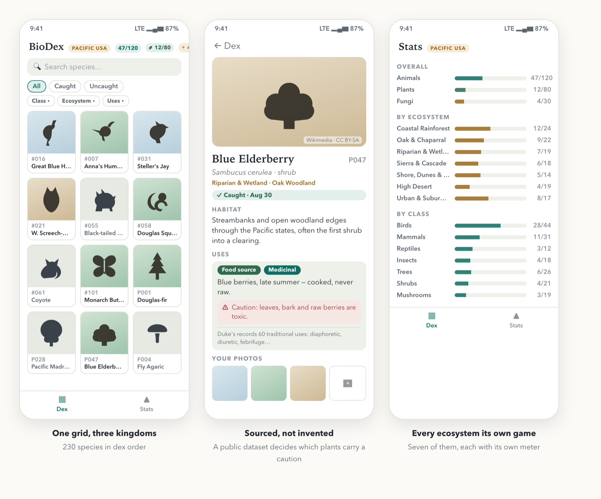
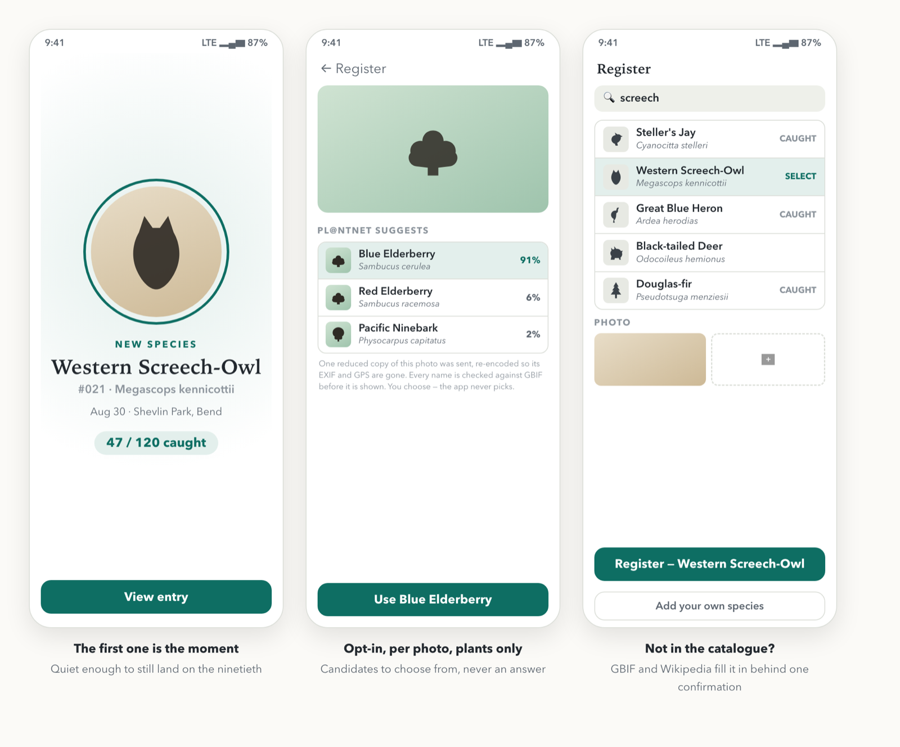

<h1 align="center">BioDex</h1>

<p align="center">
  <em>A personal Android app that turns a real-world life list into a Pokédex.</em><br>
  Every species starts as a silhouette and unlocks when you photograph it yourself.
</p>

<p align="center">
  
  
  
  
  
</p>

<p align="center">
  
</p>
<p align="center"><sub>Screens rendered from the project's design board. Every feature shown is built and shipping.</sub></p>

> [!IMPORTANT]
> **This is intended as a fun activity, and nothing in it should be construed as medical or dietary advice.** Exercise caution and do your own research on plants and animals before engaging with them.

## The game

A dex only works as a game if it can be finished, so BioDex does not ship a taxonomy. It ships one curated region — the **Pacific USA BioDex**, everything west of the Rockies — with 230 species a person can actually go and find: 120 animals (`#001`–`#120`), 80 plants (`P001`–`P080`) and 30 fungi (`F001`–`F030`). Each kingdom has its own meter, because they are played differently. The plant list is finishable in a season of walks; the animal list is a years-long luck game; folding them into one percentage would hide both facts. Plants also carry their uses — edible or medicinal, which part, which season — so the plant half doubles as a list of what is worth foraging for the camera.

Every species belongs to one or more of seven real ecosystems — coastal rainforest, oak woodland and chaparral, high desert and sagebrush, and so on — and each ecosystem carries its own fraction, so the big collection holds seven small winnable ones inside it and the grid doubles as a map of where to go next. Anything you photograph that the catalogue lacks becomes your own entry, filled in from GBIF and Wikipedia behind one confirmation, and takes a U-number outside the completion fraction: your additions can never make the dex unfinishable, and they can never inflate it either.

The first catch of a species is the moment: silhouette resolves into your photograph, the counter ticks up. The reveal is deliberately quiet, tuned to still feel good on the ninetieth unlock. Repeats join the strip without ceremony.

## Your photos stay yours

BioDex has no backend and no accounts, and it works offline from the first launch. Your photos are never copied out of your gallery. The app holds a reference and a small thumbnail of its own, and that is the point rather than a shortcut — linking is what lets a life list grow for years without the app growing with it. A plant keeps no photograph at all: its tile shows the species' own reference picture, because a catalogue portrait is a better tile than a snapshot of a shrub.

Identification is opt-in, per photo, and only for plants. Nothing leaves the phone unless you press *Identify* on a photo you attached. When you do, one reduced copy of that one photo — re-encoded, so its EXIF and GPS coordinates are gone — goes to Pl@ntNet, which returns candidate species you choose from. The app never picks one and never claims the thing in your photo *is* a species; what it says is "Pl@ntNet suggested these", in the same register as the medicinal line that credits Dr. Duke's database — a source's statement, never the app's. Animals and fungi have no identification at all.

Because the photos are referenced, backups matter more than usual, so the whole collection exports as a single ZIP — catalogue, entries, thumbnails and a full-size copy of every photo that still resolves — and import merges rather than replaces.

<p align="center">
  
</p>

## Built the way it says it is

The catalogue is generated and committed, so no build touches the network. It is joined from GBIF, Wikipedia, Wikimedia Commons and Dr. Duke's ethnobotanical database, and the build enforces two rules rather than trusting the join. A GBIF synonym is accepted only if it keeps the accepted name's specific epithet — without that rule GBIF offers Port Orford cedar as a synonym of coast redwood, and the eastern sycamore for the California one, which would have shipped confident, fluent, completely wrong data. And every plant Duke's records as poisonous must carry a one-line caution, or the build fails naming the species, so which plants get a caution is decided by a public dataset rather than by whoever wrote the entry.

The app is one Gradle module with hand-wired singletons and no DI framework; package discipline does the work module boundaries would. Every screen's state is a pure top-level function over the repository's flows, and the ViewModel is that function plus `stateIn` — which is why 441 JVM tests exercise filtering, progress math and screen state with no device and no Room, alongside 43 instrumented tests and 13 Python tests on the catalogue pipeline. Invariants live at the one door into the store: the rule that a plant keeps no photo is enforced in the single registrar that writes entries, not on the screen that collects them.

Room migrations are hand-written with schema export on, and there is no destructive fallback, because this database holds a collection that cannot be re-earned. The Pl@ntNet key lives in the app's settings rather than the build, because the repository is public and an APK is unpackable — a compiled-in key is a published key.

Kotlin 2.3, Jetpack Compose, Room, minSdk 29.

## Building it

```bash
make doctor    # check the toolchain and say what is missing
make install   # build and install onto an attached phone
make check     # JVM + catalogue tests, no phone needed
```

`make` on its own lists every target. **[docs/BUILD.md](docs/BUILD.md)** covers prerequisites, release signing, and sideloading an APK without a toolchain.

## The documents

| File | What it holds |
|---|---|
| [`DESIGN.md`](DESIGN.md) | Product requirements and decisions, numbered — `M##`, `D##` and friends, cited from the code that implements them |
| [`ARCHITECTURE.md`](ARCHITECTURE.md) | Technical decisions and their reasoning. §11.8 is what is built today |
| [`BACKLOG.md`](BACKLOG.md) | What is not started, and what is deliberately never happening |
| [`docs/BUILD.md`](docs/BUILD.md) | Setup, signing, sideloading |

## License

Code is MIT. The bundled catalogue is CC BY-SA 4.0, because it reuses Wikipedia prose, with GBIF (CC BY 4.0) and Dr. Duke's (CC0) underneath it and per-image Commons credits carried in each entry. [`LICENSE`](LICENSE) has the split in full, and the app shows the same thing at *Settings → Licenses and attribution*.
