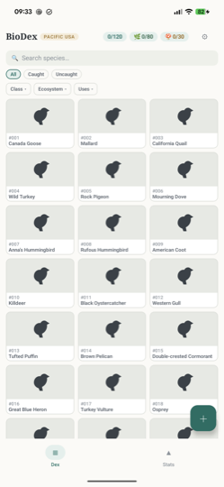
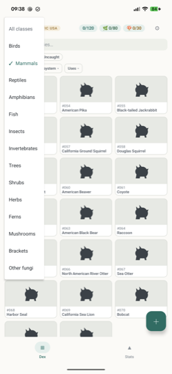
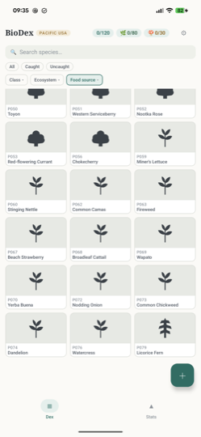

<h1 align="center">BioDex</h1>

<p align="center">
  <em>A personal Android app that turns a real-world life list into a Pokédex.</em><br>
  Every species starts as a silhouette and unlocks when you photograph it yourself.
</p>

<p align="center">
  
  
  
  
  
</p>

| The dex | Filtering | Plants |
|:--:|:--:|:--:|
|  |  |  |
| 230 species in dex order, caught ones in colour | Class, Ecosystem and Uses compose | `P`-numbers and growth-form silhouettes |

> [!IMPORTANT]
> **This is intended as a fun activity, and nothing in it should be construed as medical or dietary advice.** Exercise caution and do your own research on plants and animals before engaging with them.

## At a glance

It ships with a curated catalogue for one region — the **Pacific USA BioDex**, everything west of the Rocky Mountains.

| | Count | Numbering | Notes |
|---|--:|---|---|
| 🦉 **Animals** | 120 | `#001`–`#120` | Seven classes, from birds to invertebrates |
| 🌿 **Plants** | 80 | `P001`–`P080` | Grouped by growth form; carry a uses section |
| 🍄 **Fungi** | 30 | `F001`–`F030` | No uses, no identification |

Each kingdom is its own completable game, with its own meter. Species you add yourself get **U-numbers** and sit outside the completion fraction, so they never make the dex unfinishable.

**Your photos stay in your gallery.** For an animal or a fungus the app stores a reference and a small thumbnail, never a copy. A plant keeps no photograph at all — its entry shows the catalogue's own reference picture instead.

**Identification is opt-in, and only for plants.** Nothing is uploaded unless you press *Identify* on a photo you attached. When you do, a reduced copy of that one photo — re-encoded, so its EXIF and its GPS coordinates are gone — goes to the Pl@ntNet API, which sends back candidate species you choose from. The app never picks one for you and never claims the thing in your photo *is* a species. Animals and fungi have no identification at all: if you don't know what you're looking at, use Google Lens and type the name in.

## Using it

**Catching something.** Tap the **+** button on the grid, or open a species and tap *Register this species*. Search by name, pick the species, attach a photo from your gallery, and register. The species flips from silhouette to your photograph and the counter ticks up. Photograph the same species again and the picture joins its strip without ceremony — the fanfare is reserved for firsts.

> [!NOTE]
> The gallery picker needs an explicit **Done** tap after you select a photo. Selecting alone returns nothing.

**Something not in the catalogue.** Type its name and choose *add your own species*. GBIF resolves the name to a real species, Wikipedia supplies habitat text and a photograph, and for a plant Duke's ethnobotanical database supplies its recorded medicinal uses. You get a confirmation card before anything is saved, because a name like "sparrow" matches several species and a silent wrong pick would be permanent.

Offline, the entry is created immediately from the name and photo alone, and fills in the next time you open it with a connection.

**Filtering.** *Caught* and *Uncaught* are chips; *Class*, *Ecosystem* and *Uses* are dropdowns underneath them. They compose rather than replace — *Mammals* + *Riparian & Wetland* narrows to exactly the four wetland mammals. Each menu marks the value currently filtering and opens with a row that undoes just that one (*All classes*, *All ecosystems*, *Any use*); the *All* chip clears the lot. There is no kingdom filter, because picking *Trees* or *Mammals* already says which kingdom you meant. Search matches common and scientific names.

**Plants have a uses section** where an animal has nothing: a short note on which part and which season, and a muted line recording what Duke's holds. Any plant Duke's records as toxic carries a one-line caution, and the build fails if one is missing — so which plants get a warning is decided by a public dataset rather than by whoever wrote the entry.

**Fungi carry no uses**, no medicinal line and no identification. A mushroom gets a note only when the species itself is dangerous, which is ten of the thirty. The rest read like an animal.

<details>
<summary><strong>When a photo breaks, and why backups matter more than usual</strong></summary>

**Your photos can break.** If you delete a photo from your gallery, the entry stays caught and shows its thumbnail with an offer to re-link. A photo that lives only in Google Photos' cloud and hasn't downloaded may not resolve until you're online. Turning on *Keep a local copy* in Settings makes future registrations immune to this, at the cost of storing the photo twice; it is off by default because linking rather than copying is the point.

**Backups matter more than usual here**, precisely because photos are referenced. `Settings → Export collection…` writes one ZIP — the catalogue, every entry, every thumbnail, and a full-size copy of each photo whose reference still resolves — and hands it to the share sheet. Import merges rather than replaces: it adds what is missing, skips catches it already has, and deletes nothing.

</details>

## Building it

```bash
make doctor    # check the toolchain and say what is missing
make install   # build and install onto an attached phone
make check     # JVM + catalogue tests, no phone needed
```

`make` on its own lists every target. **[docs/BUILD.md](docs/BUILD.md)** covers prerequisites, release signing, and sideloading an APK without a toolchain.

## The catalogue

`app/src/main/assets/catalogue/pacific.json` is generated and committed, so no build touches the network. It is built from four hand-authored input files plus four public sources:

| Source | Supplies | Licence |
|---|---|---|
| GBIF | accepted scientific name, kingdom, class, synonyms | open |
| Wikipedia | habitat prose, description, page link | CC BY-SA |
| Wikimedia Commons | reference image and its credit | per-image |
| Dr. Duke's (USDA ARS) | plant medicinal uses, activity list, poison flag | CC0 |

```bash
make catalogue    # regenerate the asset
```

Standard library only — no virtualenv, no dependencies. Responses cache under `tools/catalogue/cache/`, so a re-run makes zero HTTP requests. See [`tools/catalogue/README.md`](tools/catalogue/README.md).

Two rules the build enforces rather than trusting:

- **Every plant with a `Poison` record in Duke's must carry a `Caution:` sentence**, or the build fails naming the species. The cautioned set is decided by a public dataset, not by whoever wrote the entry.
- **A synonym is only accepted if it keeps the accepted name's specific epithet.** Without this, GBIF offers Port Orford cedar as a synonym of coast redwood, and the eastern sycamore for the California one — which would have shipped confident, fluent, completely wrong data.

Edible tags are curatorial judgement and are not derived from any source; the catalogue says so in each entry's provenance.

## The documents

| File | What it holds |
|---|---|
| [`DESIGN.md`](DESIGN.md) | Product requirements and decisions, numbered — `M##`, `D##` and friends, cited from the code that implements them |
| [`ARCHITECTURE.md`](ARCHITECTURE.md) | Technical decisions and their reasoning. §11.8 is what is built today |
| [`BACKLOG.md`](BACKLOG.md) | What is not started, and what is deliberately never happening |
| [`docs/BUILD.md`](docs/BUILD.md) | Setup, signing, sideloading |

## License

Code is MIT. The bundled catalogue is CC BY-SA 4.0, because it reuses Wikipedia prose, with GBIF (CC BY 4.0) and Dr. Duke's (CC0) underneath it and per-image Commons credits carried in each entry. [`LICENSE`](LICENSE) has the split in full, and the app shows the same thing at *Settings → Licenses and attribution*.
